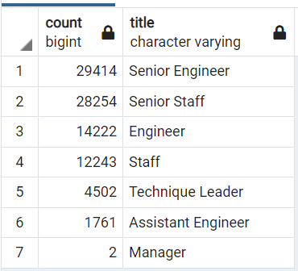
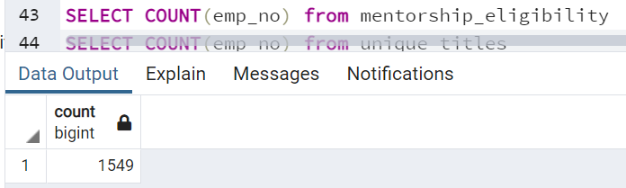
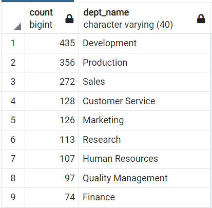
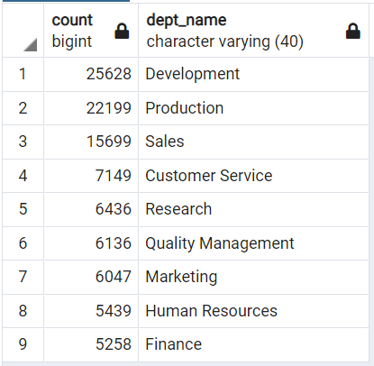

# Pewlett-Hackard-Analysis
PostgreSQL and pgAdmin

## Overview of the analysis
The following analysis is conducted using PostgreSQL to determine the number of retiring employees per title and identify the employees who are eligible to participate in a mentorship program. The analysis shall provide a conclusion for the manager to better handle the "silver tsunami".

## Results
Through the observation of the processed data below, it can be concluded that:  
- The title for the highest number of retiring employees is "Senior Engineer", which reaches close to 30k.  
- The title for the second-highest number of retiring employees is "Senior Staff", which has the number similar to the highest title.  
- The title for the least number of retiring employees is "Manager", which only has a number of 2.  
- By processing the mentorship chart, in total there are 1549 employees qualified for the program.  

  

## Summary
- By counting the number of retiring employees from the "unique titles" chart, there are in total 90348 roles needed to be filled.  
- No there aren't enough qualified, retirement-ready employees in the department to mentor the next generation.  
More Insights:
By comparing the two charts below (A. Department name sorted by the number of retiring employees. B. Department name sorted by the number of employees qualified for the mentorship), it can be noticed that the number of retiring employees is much larger than that of mentors. Therefore, it is challenging to mentor the next generation of employees.  

